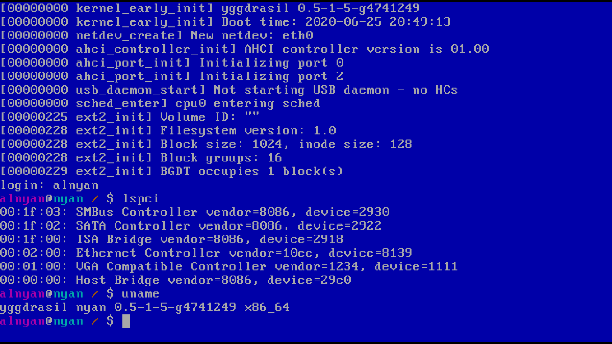

Yggdrasil x86-64 kernel
======================================

UPD Nov. 20, 2020: this kernel is a live manifestation of my
extremely poor architecture designing skills. The current
state of the project is frozen as of yet and I am beginning
work on a proper redesign and rewrite of the kernel.

Yggdrasil is the name for my kernel development project which
tries to follow the Unix principles (yet another POSIX
OS?) and is loosely inspired by stuff like Linux,
BSD and other *nixes I've laid my hands on so far.

Building
--------

See [Building Guide](doc/building.rst)

What works
----------

* Preemptive multitasking (kernel/user)
* VFS implementation with non-resident ("mapper") filesystem support
* ext2 driver supporting both read/write (pending rewrite though), directories and symlinks
* VT100 basic control sequences for color/cursor control in tty.
* tar-based initrd with programs and other files for userspace
* Over 50 system calls for POSIX-like interface: fork()/execve()/read()/write()/...

What works: devices
-------------------

* RTL8139 Network Controller - both Tx/Rx
* AHCI SATA controllers (Read/Write)

Credits
-------

* Linux for default8x16 font
